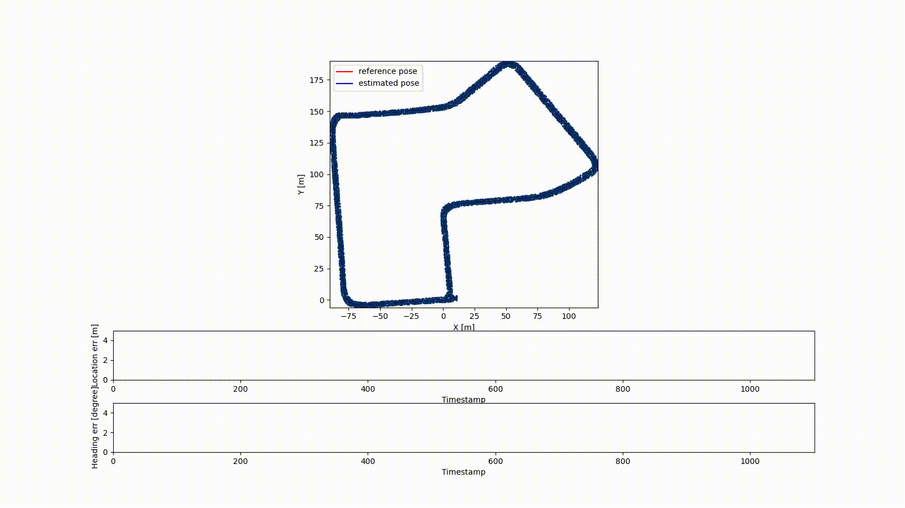
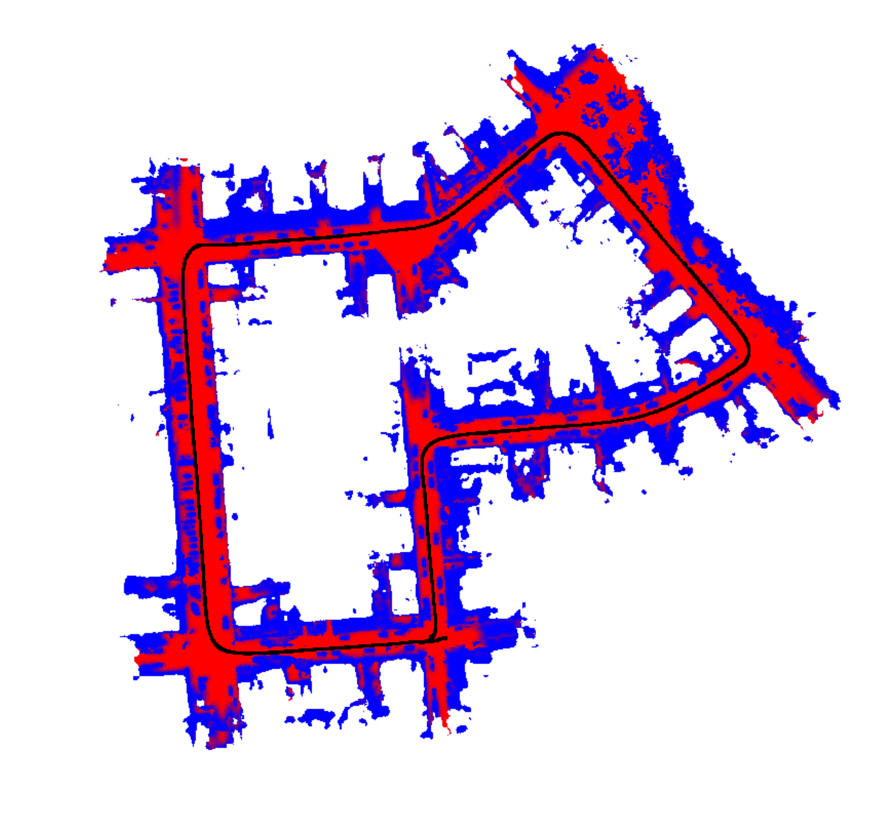
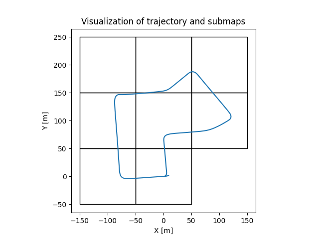

# Range Image-based 3D LiDAR Localization

This repo contains the code for our ICRA2021 paper: Range Image-based LiDAR Localization for Autonomous Vehicles.

Developed by [Xieyuanli Chen](http://www.ipb.uni-bonn.de/xieyuanli-chen/), [Ignacio Vizzo](https://www.ipb.uni-bonn.de/ignacio-vizzo/), [Thomas Läbe](https://www.ipb.uni-bonn.de/thomas-laebe/) and [Jens Behley](https://www.ipb.uni-bonn.de/jens-behley/).
 
It uses a novel sensor model with MCL to achieve 3D LiDAR global localization and pose tracking. The sensor model compares the range image of the current LiDAR scan to the synthetic range images rendered from the triangular mesh to update the weight of particles. This method is simple but can be used with different types of LiDAR scanners in different datasets and environments without fine-tuning.



Online localization demo.


<p float="left">
  
   
</p>

Visualizations: Left: the triangular mesh and the localization results; Right: Sub-tile maps 

### Table of Contents
0. [Introduction](#Range-Image-based-3D-LiDAR-Localization)
1. [Publication](#Publication)
2. [Dependencies](#Dependencies)
3. [How to use](#How-to-use)
4. [Related work](#Related-work)
5. [License](#License)

## Publication
If you use our implementation in your academic work, please cite the corresponding [paper](http://www.ipb.uni-bonn.de/pdfs/chen2021icra.pdf):
    
	@inproceedings{chen2021icra,
		author = {X. Chen and I. Vizzo and T. L{\"a}be and J. Behley and C. Stachniss},
		title = {{Range Image-based LiDAR Localization for Autonomous Vehicles}},
		booktitle = icra,
		year = 2021,
		url = {http://www.ipb.uni-bonn.de/pdfs/chen2021icra.pdf},
		codeurl = {https://github.com/PRBonn/range-mcl}
	}

## Dependencies

The code was tested with Ubuntu **20.04** with its standard python version **3.8**.

We are using OpenGL to do achieve fast rendering, so you will need an OpenGL capable graphics
card (we use Nvidia cards, e.g. 2080Ti) to be fast.

- System dependencies related to OpenGL:

  ```bash
  sudo apt-get update 
  sudo apt-get install libgl1-mesa-glx
  ```

- Other system dependencies:

  ```bash
  sudo apt-get update 
  sudo apt-get install libusb-1.0   # open3d 0.12.0 dependency
  sudo apt-get install -y python3-pip
  sudo -H pip3 install --upgrade pip
  ```

- Python dependencies (may also work with different versions than mentioned in the requirements file)

  ```bash
  sudo -H pip3 install -r requirements.txt
  ```

## How to use

### Quick use
For a quick demo, one could download the [mesh map](http://www.ipb.uni-bonn.de/html/projects/range-mcl/mesh_kitti_07.ply) 
and LiDAR [data](http://www.ipb.uni-bonn.de/html/projects/range-mcl/kitti-07.zip), 
extract the them in the `/data` folder following the recommended [data structure](data/README.md), and then run:
  ```bash
  cd src/
  python3 main_range_mcl.py
  ```
One could then get the online visualization of range-based MCL as shown in the gif.

### More detailed usage
Here, we provide more detailed information about our range-image-based LiDAR localization method,
including building mesh maps, evaluating the localization results and more pre-built maps of different datasets.

#### Build mesh map 
To build a mesh map, we use the Poisson surface reconstruction provided by the Open3D library.
One need to download the LiDAR [data](http://www.ipb.uni-bonn.de/html/projects/range-mcl/kitti-07.zip), 
extract the them in the `/data` folder following the recommended [data structure](data/README.md), and then run:
  ```bash
  python3 build_mesh_map.py
  ```

For fast calculating and generating range and normal data for LiDAR scans, one could find more details [here](src/map_building/c_utils/README.md).

**Important tips**
- We used our moving object segmentation method ([paper](http://www.ipb.uni-bonn.de/pdfs/chen2021ral-iros.pdf)) to clean the scans before building the map. 
One could also use other methods to clean the map.
- To build the mesh map, one needs to first get the map reference poses provided by the dataset or obtained use SLAM.
- For the sake of demonstration, we use the same data from KITTI 07 for both mapping and localization. However, in a real application (e.g. all the experiments in the [paper](http://www.ipb.uni-bonn.de/pdfs/chen2021icra.pdf)), the data for mapping and localization are collected in different seasons of the same area.
- For the sake of demonstration, we use the ground truth odometry poses provided by the KITTI dataset and add noise to them. In a real application, one doesn't need to add noise to the odometry information (see [motion_model.py](https://github.com/PRBonn/range-mcl/blob/main/src/motion_model.py)).

#### Evaluation
Once finished the localization process, one would get the localization results at `/results`.
To evaluate the localization results, one could check the `evaluation.py`.
For a quick demo, one just need to run
  ```bash
  python3 evaluation.py
  ```
#### Collection of mesh maps
Notice that, the mesh maps were generated using the data from [KITTI dataset](http://www.cvlibs.net/datasets/kitti/eval_odometry.php), [MulRan dataset](https://sites.google.com/view/mulran-pr/dataset) and [Apollo dataset](https://apollo.auto/southbay.html).
Please register on their official website to apply for the original data.

- [KITTI sequence 07](http://www.ipb.uni-bonn.de/html/projects/range-mcl/mesh_kitti_07.ply) (original data from [KITTI dataset](http://www.cvlibs.net/datasets/kitti/eval_odometry.php))
- [MulRan KAIST 02](http://www.ipb.uni-bonn.de/html/projects/range-mcl/mesh_mulran_kaist.ply) (original data from [MulRan dataset](https://sites.google.com/view/mulran-pr/dataset))
- [Apollo SouthBay](http://www.ipb.uni-bonn.de/html/projects/range-mcl/mesh_apollo_southbay.ply) (original data from [Apollo dataset](https://apollo.auto/southbay.html))


## Related work
### [Puma](https://github.com/PRBonn/puma): Poisson Surface Reconstruction for LiDAR Odometry and Mapping
We also released the implementation of the algorithms described in our paper Poisson Surface Reconstruction for LiDAR Odometry and Mapping.
This is a LiDAR Odometry and Mapping pipeline that uses the Poisson Surface Reconstruction algorithm to build the map as a triangular mesh online.

### [Overlap-localization](https://github.com/PRBonn/overlap_localization): Overlap-based 3D LiDAR Monte Carlo Localization
We previously also proposed a learning-based global localization method, called overlap localization.
It uses the [OverlapNet](https://github.com/PRBonn/OverlapNet) to train an observation model for Monte Carlo Localization and achieves global localization with 3D LiDAR scans.

## License

Copyright 2021, Xieyuanli Chen, Ignacio Vizzo, Thomas Läbe, Jens Behley, Cyrill Stachniss, Photogrammetry and Robotics Lab, University of Bonn.

This project is free software made available under the MIT License. For details see the LICENSE file.


